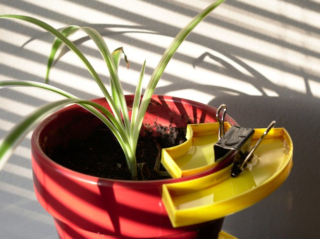
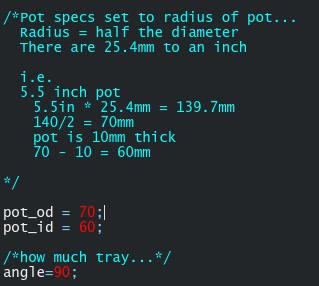

Eco House Plant Gnat Trap
===

Summary
---
Customizable house plant trays which can be filled with a solution of water vinegar and dish soap.

1. Configure
2. Print
3. Fill
4. Carnage

To Customize 
---

1. Open OpenSCAD
2. Configure variables
3. Press the Go button
* Other variables can be configured within the script
*If you are unfamiliar with OpenSCAD you won't need to understand anymore than this..*

Print Settings
----

| Print Setting | Value | 
| --- | --- | 
| Material | PLA | 
| Layer Height | 0.2mm | 

Appendix
---
[https://homeguides.sfgate.com/use-vinegar-rid-fungus-gnats-house-plant-40394.html](https://homeguides.sfgate.com/use-vinegar-rid-fungus-gnats-house-plant-40394.html)
